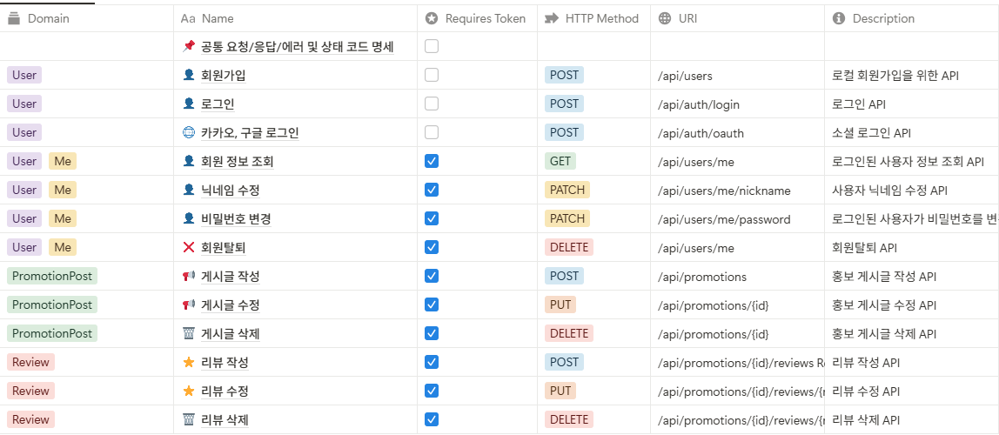

# 🎤 버스킹 현황 게시판 - Soft Team

> 버스커와 관객이 연결되는, 실시간 지도 기반 버스킹 플랫폼

---

## 📸 0. 썸네일


---

## 💡 1. 아이디어 소개

> **버스커들의 공연 일정을 시각적으로 제공하고, 관람객은 위치 기반으로 공연을 탐색할 수 있는 플랫폼**

- 버스커는 자신을 홍보하고, 공연 정보를 등록할 수 있습니다.
- 사용자(관객)는 지도 기반으로 실시간 버스킹 일정을 쉽게 확인할 수 있습니다.
- 리뷰 및 게시판 기능을 통해 공연 후 피드백 및 자유로운 커뮤니케이션이 가능합니다.

### 문제점
- 버스킹 일정 및 위치 정보 제공 채널이 불분명하고 단편적임
- 버스커와 관람객 간의 피드백 창구가 부족함
- 공연 홍보가 개인 SNS에 의존되어 파편화됨

### 해결방안
- 버스킹 일정을 지도 기반으로 통합 제공
- 간편 로그인, 후기 시스템 도입
- 홍보 게시판 및 자유 게시판으로 소통 강화

---

## 🕐 2. 개발 기간

| 구분 | 기간 |
|------|------|
| 전체 개발 | 2025.03 ~ 2025.06 |
| 기능 구현 | 2025.03 ~ 2025.05 |

---

## 👨‍👩‍👧‍👦 3. 팀원 소개 - Soft

| 멤버 | 역할 |
|------|------|
| 신동진 | 🔐 로그인 / 회원가입 기능, 👤 회원 관련 기능 구현 |
| 최용준 | 📐 ERD 설계, 📚 기능 구조화, 📄 API 명세서 작성, 🧪 User 테스트코드 작성 |
| 유승범 | 📝 게시판 구현 및 🗺️ 카카오맵 연동, 📄 API 명세서 작성, 🧪 PromotionPost 테스트코드 작성 |

---

## 🛠 4. 개발 환경

### Backend
- Java 21
- Spring Boot 3.x
- Spring Security, JPA
- MySQL (AWS RDS)
- JWT 기반 인증
- Swagger

### Frontend
- React
- React Router
- Zustand

### 기타
- Kakao Maps API
- AWS EB (배포), aws RDS (DB)

---

## 🔀 5. 브랜치 전략 및 협업 규칙

- `main`: 배포 브랜치
- `develop`: 모든 기능이 merge 되는 통합 브랜치
- `feat/*`: 기능 단위 작업 브랜치
- Pull Request는 **2인 이상 리뷰 승인 후** merge 진행

---

## 📁 6. 프로젝트 구조

```plaintext
📦 backend/
├─src/
│
├── main/
│   └── java/
│       └── busking/
│           └── busking_project/
│               ├── BuskingProjectApplication.java
│               ├── SecurityConfig.java
│               ├── WebConfig.java
│               ├── WebController.java
│
│               ├── Busking_Schedule/
│               │   ├── BuskingController.java
│               │   ├── BuskingRepository.java
│               │   ├── BuskingSchedule.java
│               │   ├── BuskingService.java
│               │   ├── BuskingStatus.java
│               │   └── dto/
│               │       ├── BuskingCreateRequest.java
│               │       ├── BuskingResponse.java
│               │       └── LocationWithScheduleDto.java
│
│               ├── base/
│               │   └── BaseEntity.java
│
│               ├── board/
│               │   ├── BoardPost.java
│               │   ├── BoardPostController.java
│               │   ├── BoardPostRepository.java
│               │   ├── BoardPostService.java
│               │   └── dto/
│               │       ├── BoardPostRequestDto.java
│               │       └── BoardPostResponseDto.java
│
│               ├── comment/
│               │   ├── Comment.java
│               │   ├── CommentController.java
│               │   ├── CommentRepository.java
│               │   ├── CommentService.java
│               │   └── dto/
│               │       ├── CommentRequestDto.java
│               │       └── CommentResponseDto.java
│
│               ├── location/
│               │   ├── Location.java
│               │   ├── LocationController.java
│               │   ├── LocationRepository.java
│               │   ├── LocationService.java
│               │   └── dto/
│               │       ├── LocationCreateRequest.java
│               │       └── LocationResponse.java
│
│               ├── promotion/
│               │   ├── PromotionPost.java
│               │   ├── PromotionPostController.java
│               │   ├── PromotionPostRepository.java
│               │   ├── PromotionPostService.java
│               │   └── dto/
│               │       ├── PromotionPostRequestDto.java
│               │       └── PromotionPostResponseDto.java
│
│               ├── review/
│               │   ├── Review.java
│               │   ├── ReviewController.java
│               │   ├── ReviewRepository.java
│               │   ├── ReviewService.java
│               │   └── dto/
│               │       ├── ReviewRequestDto.java
│               │       └── ReviewResponseDto.java
│
│               └── user/
│                   ├── User.java
│                   ├── UserController.java
│                   ├── UserRepository.java
│                   ├── UserService.java
│                   └── dto/
│                       ├── RegisterRequestDto.java
│                       └── UserResponseDto.java
│
├── test/
│   └── java/
│       └── busking/
│           └── busking_project/
│               ├── promotion/
│               │   └── PromotionPostControllerTest.java
│               ├── review/
│               │   └── ReviewControllerTest.java
│               └── user/
│                   └── AuthControllerTest.java
│
📦 frontend/src/
├── api/
│   ├── api.js
│   ├── auth.js
│   ├── busking.js
│   ├── board.js
│   ├── comment.js
│   ├── promotion.js
│   ├── review.js
│   └── user.js
│
├── components/
│   ├── Header.jsx
│   ├── Footer.jsx
│   ├── Map.jsx
│   ├── BuskingCard.jsx
│   └── ...
│
├── pages/
│   ├── HomePage.jsx
│   ├── LoginPage.jsx
│   ├── LoginFailedPage.jsx
│   ├── RegisterPage.jsx
│   ├── BuskingListPage.jsx
│   ├── BuskingCreatePage.jsx
│   ├── BuskingDetailPage.jsx
│   ├── PromotionListPage.jsx
│   ├── PromotionPage.jsx
│   ├── PromotionEditPage.jsx
│   ├── BoardPage.jsx
│   ├── BoardPostPage.jsx
│   ├── BoardEditPage.jsx
│   ├── MyPage.jsx
│   └── ...
│
├── App.jsx
├── main.jsx
```
---

## 📑 7. API 명세서



---

## 🧩 8. 세부 기능 설명

### 🔐 사용자 인증
- 일반 로그인 / 회원가입 (JWT)
- 소셜 로그인 (구글, 카카오 OAuth2)
- 사용자 정보 조회 / 닉네임 수정
- 로그아웃 및 탈퇴 (소프트 삭제 및 복구 기능 포함)

### 🗓 버스킹 일정 관리
- 공연 일정 등록 / 조회 / 삭제
- 일정 상태 자동 변경 (예정 → 진행 중 → 완료)
- 날짜별 필터 기능

### 🗺 장소 관리
- 카카오 지도 기반 마커 등록
- 공연 장소 선택 및 조회
- 중복 예약 방지

### 📢 홍보 게시판
- 공연 홍보용 글 등록/수정/삭제
- 지도에서 마커 클릭 시 공연 정보 팝업
- 후기 작성 기능 연동

### 📝 일반 게시판
- 자유로운 글 작성, 수정, 삭제
- 댓글, 대댓글(답글) 기능
- 조회 수 1회 제한(로그인 사용자 기준)

---

## 🧭 9. ERD


---

## 🚀 10. 배포 및 CI/CD
- GitHub Actions 기반 CI/CD 구축
  - develop 브랜치에서 CI 실행
  - main 브랜치 merge 시 AWS EB 자동 배포
- 테스트 환경에서는 H2 DB, 운영 환경에서는 RDS(MySQL) 사용


---

## 🔧 11-1. 트러블슈팅: API 명세서 작성 이전에 기능 구현으로 인한 대규모 수정 발생

#### 💥 문제 상황
- 팀원 API 명세서를 작성하지 않고 기능 구현부터 먼저 진행.
- 기능 구현 이후 내가 API 명세서를 작성했으나, URL과 제약사항 등이 팀원의 구현과 큰 차이가 발생함.
- RESTful 한 설계를 지향했으나, 팀원이 구현한 URL 표현 방식이 서로 달라 추후에 대규모 리팩토링 필요.
- 예시로 회원가입의 경우 username 필드의 제약사항(영문, 숫자, 밑줄만 허용, 5~20자)이 일치하지 않음.
- 공통 에러 코드 형식 또한 서로 달라 클라이언트와의 협업 과정에서 혼란 발생.

#### 🔍 원인 분석
- API 명세서를 우선 작성하지 않고 각자 개별적으로 기능 구현을 먼저 진행하여 통일성 부재.
- RESTful 설계 기준이나 요청 필드의 제약사항 등 API 스펙에 대한 팀 내 합의가 미비.
- 구현된 코드 기반으로 명세서를 역으로 작성하다 보니, API 문서와 실제 코드 간 구조적 불일치 발생.

#### 🛠 해결 과정
1. API 명세서와 구현 코드의 차이점 분석
    - 기존 구현된 기능과 내가 작성한 RESTful 한 API 명세서의 불일치 항목 목록화.
    - 특히 URL 구조와 요청 필드, 제약사항, 에러 응답 형식 등 세부적인 차이점을 문서화.
2. 팀원과의 RESTful API 설계 기준 논의 및 합의
    - 팀원과 함께 회의를 통해 RESTful API 설계의 중요성 및 일관된 구조 사용의 필요성을 공유.
    - URL 설계(POST /api/users, PUT /api/promotions/{id} 등) 및 필드 제약사항(정규식, 길이 제한 등)을 명확히 정의하여 공유.
3. 기존 구현 코드의 대규모 리팩토링 진행
    - 합의된 API 명세서와 일치하도록 URL, DTO 필드, 유효성 검증 로직을 대규모로 리팩토링.
    - 공통 에러 코드를 일관된 응답 형식(success, message, data, errorCode)으로 통일하여 프론트와의 협업 효율성 향상.
4. 향후 API 개발 프로세스 명확화
    - 반드시 API 명세서를 먼저 작성하고, 팀 내 리뷰를 거쳐 승인된 후 기능 구현을 시작하는 프로세를 확립.
    - 협업 도구(Notion)에 명세서를 미리 작성하고 공유하여 동기화 유지.

#### ✅ 결과
- API 명세서와 실제 구현 코드가 완전히 일치하여, 이후 클라이언트와의 연동 및 협업 과정이 원활해짐.
- API 구조의 일관성 유지로 인해 코드의 유지보수성 및 가독성 향상.
- 팀 내 명확한 API 설계 기준 확립으로 인해 개발 생산성 증가 및 불필요한 수정 작업 감소.

#### 📌 회고
- 명세서 없이 기능 구현을 먼저 진행하면 개발 중간에 큰 혼란과 비효율이 발생함을 깨달음.
- 반드시 RESTful 한 API 명세서를 먼저 설계한 후 기능 구현을 해야 한다는 중요한 교훈을 얻음.
- API 개발 시 협업과 소통의 중요성을 실질적으로 경험하여, 앞으로는 사전에 충분한 논의와 명세서 작성을 거쳐야 한다고 다짐함.

---

## 🔧 11-2. 트러블슈팅: Git 미숙지로 인한 협업 및 코드 관리 문제 해결

#### 💥 문제 상황
- 프로젝트 초기 단계에 Git 사용법을 몰라 각자 로컬에서만 프로젝트 파일을 관리함.
- 서로의 코드를 병합(merge)하거나 동기화하기 매우 어려워 협업 효율성이 크게 떨어졌음.
- 코드 버전 관리 미흡으로 인해 충돌(conflict) 및 파일 누락 발생.

#### 🔍 원인 분석
- Git과 GitHub에 대한 이해 부족 및 기본적인 협업 명령어(push, pull, merge, branch 등)를 몰랐음.
- 프로젝트를 진행하는 데 있어 별도의 형상관리 도구나 원격 저장소를 활용하지 않음.

#### 🛠 해결 과정
1. Git과 GitHub의 기본적인 협업 명령어 및 기능(push, pull, commit, branch, merge, conflict 해결법 등)을 공부하고 직접 실습함.
2. 습득한 내용을 팀원들에게 정리하여 공유하고, 함께 Git 명령어 사용법에 익숙해지도록 도움을 줌.
3. 프로젝트를 GitHub에 원격 저장소로 생성하고, 로컬 프로젝트와 연결하여 협업 환경 구축 완료.

#### ✅ 결과
- 코드 병합 및 파일 관리를 훨씬 수월하게 진행할 수 있게 되었음.
- 프로젝트 파일의 버전 관리가 명확해지고 협업 과정에서의 혼란과 오류가 크게 감소함.

#### 📌 회고
- Git은 협업 프로젝트에서 필수적인 도구이며, 초기에 충분히 숙지한 후 프로젝트를 시작해야 함.
- 협업 시 원격 저장소(GitHub 등) 활용을 통해 명확한 코드 관리와 버전 히스토리를 유지하는 것이 매우 중요함을 깨달음.
- 문제를 해결하면서 팀의 전체적인 협업 효율성 및 코드 품질 향상에 큰 도움이 됨을 직접 체험함.
- 당장의 프로젝트를 하기 위해서 기본적인 Git 명령어와 사용법만 공부하였는데, Git과 GitHub를 제대로 활용하기 위해 프로젝트가 끝나면 Git을 보다 깊이 공부해야겠다고 생각함.

---

## 🔧 11-3. 트러블슈팅: CI/CD 파이프라인 부재로 인한 브랜치 병합(Merge) 후 발생하는 오류 사전 발견 불가 문제

#### 💥 문제 상황
- 프로젝트 진행 중 CI/CD 파이프라인 구축 부재로 인해 develop 브랜치 병합 후 코드가 정상 작동하는지 즉각 확인 불가능.
- 특히 각자 팀원이 develop 브랜치에서 feat 브랜치를 뻗어 각자의 기능/테스트를 개발한 후 다시 develop에 병합할 때, 
 팀원이 먼저 develop 브랜치에 병합한 코드와 충돌이 생기거나 환경이 달라져서, 로컬에서의 테스트 성공과는 별개로 병합 후 문제가 발생하는 일이 잦았음.
- develop 브랜치 병합 후 발생하는 오류는 즉각 해결이 어렵고, 다시 이전 버전으로 되돌리는 과정이 매우 번거로웠음.

#### 🔍 원인 분석
- 각자 개발 환경에서 독립적으로 기능을 개발한 뒤, 다른 팀원의 최신 코드가 반영된 develop 브랜치에서의 통합 테스트가 없었기 때문임.
- merge 전에 미리 통합 환경에서의 자동 테스트와 빌드를 통한 검증 과정 부재가 근본적인 원인이었음.

#### 🛠 해결 과정
1. GitHub Actions 기반으로 CI/CD 파이프라인 환경 구축
    - develop 브랜치를 대상으로 **Pull Request가 열릴 때마다 자동으로 CI(빌드 및 테스트)**를 수행하여 병합 전 미리 오류를 파악할 수 있도록 함.
    - **최종 배포(CD)**는 프로젝트 규모가 작고 비용 절감을 위해 main 브랜치 병합 후 수동으로 실행하는 방식으로 설정함.
2. 실제 적용된 ci-cd.yml 예시는 아래와 같음:
    ```yaml
    on:
      pull_request:
        types: [opened, synchronize, reopened]
        branches: [develop]  # ✅ develop 대상 PR에서만 CI 실행
    
      workflow_dispatch:  # ✅ CD는 수동 실행 (main 브랜치 병합 후)
    
    ...
    
    # ✅ CD: 수동 배포 (main 브랜치 기준)
    deploy:
      name: 🚀 Deploy to Elastic Beanstalk
      if: github.ref == 'refs/heads/main'  # ✅ main 브랜치 병합 후만 실행
      needs: [backend, frontend]           # ✅ CI 성공 후만 실행
      runs-on: ubuntu-latest
    ```
3. 이를 통해 팀원이 먼저 병합한 코드로 인해 생긴 develop 브랜치의 변경사항을 빠르게 파악하고,
 본인의 feat 브랜치에서 미리 충돌이나 통합 오류를 수정할 수 있게 됨.

#### ✅ 결과
- 각자 작업한 브랜치 병합 전에 미리 GitHub Actions에서 자동으로 빌드 및 테스트가 수행되어 develop 병합 후 예상되는 오류를 미리 파악 가능.
- 최종 배포는 수동으로만 실행하여 비용 관리와 배포 안정성을 확보함.
- 실제 마지막 배포 과정도 정상적으로 진행되어 안정적인 결과를 얻음.

#### 📌 회고
- 각자 로컬 환경에서 독립적으로 개발할 때 "로컬에서의 성공 = 병합 후에도 성공"이 아니라는 점을 깨닫게 됨.
- CI 환경에서 PR 기반의 자동 검증 과정은 효율적인 협업과 품질 높은 코드를 보장하는 필수 요소라는 것을 배움.
- 작은 규모 프로젝트에서는 배포를 자동화하지 않고, 비용 효율성을 고려해 수동으로 진행하는 전략도 매우 효과적임을 알게 됨.
- 추후 규모가 커진 프로젝트를 할 시 자동 배포를 통해 더 효율적인 CI/CD 전략을 세울 수 있다는 것을 알게 됨.

---

## 🔧 11-4. 트러블슈팅: 로그인 테스트 코드 실패

### 💥 문제 상황
- `AuthControllerTest`에서 회원가입 후 로그인 시도 시 401 오류 발생.
- 로컬에서는 정상적으로 통과되던 테스트가 GitHub Actions CI 환경에서만 실패.

### 🔍 원인 분석
- 테스트 환경에서 `test` 프로파일을 명시하지 않아 `application.yml`의 설정이 적용되면서, 실제 RDS(MySQL)에 연결하려고 시도함.
  - 로컬에서는 `application-secret.yml` 파일이 존재하므로 문제가 없었지만, CI 환경에서는 GitHub Secrets를 통해 주입되므로 해당 설정이 없으면 연결 실패.

### 🛠 해결 과정
1. `application-test.yml` 생성. 
  - 테스트 전용 H2(인메모리 가상 DB) 설정을 추가하여 RDS 연결 없이 테스트 가능하도록 구성.

2. CI 설정에서 `SPRING_PROFILES_ACTIVE: test`추가
   - `application.yml`이 아닌 `application-test.yml`을 사용하도록 명시.
```yaml
- name: Run tests with H2 profile
    env:
      SPRING_PROFILES_ACTIVE: test     # <-- 핵심
    run: ./gradlew clean test
```

3. `@ActiveProfiles("test")` 어노테이션 추가
  - `AuthControllerTest` 클래스에 명시하여 테스트 환경에서도 `application-test.yml`이 적용되도록 설정.

4. `application.yml`의 import 구문을 optional로 설정
   - `application-secret.yml`이 없더라도 test 환경에서 오류가 나지 않도록 처리.
     - ```yaml
       import: "optional:classpath:/application-secret.yml"
       ```

#### ✅ 결과
- 테스트 실행 시 회원가입 후 로그인 동작이 H2(인메모리 가상 DB)에서 처리되어 성공.
- 더 이상 RDS 접속 오류나 인증 실패 없이 테스트 통과.

#### 📌 회고
- 테스트 환경에서는 실 DB(RDS/MySQL) 대신 H2(인메모리 가상 DB)를 사용하자.
  - 테스트는 빠르고 독립적이며 반복 가능해야 하며, H2는 이러한 요건 가장 적합하다.
  - 속도, 안정성, 비용, 구성 편의성 측면에서 H2는 RDS보다 테스트에 최적화되어 있다.
- 하지만 다음과 같은 경우에는 H2 대신 실제 MySQL(RDS) 사용이 필요할 수 있다.
  - 쿼리 호환성이 문제가 되거나 제약 조건 테스트(FK, Unique), 마이그레이션 검증 등.
- 이번 경험을 통해 CI에서는 빠르고 안전한 H2를, 실 배포 전 Staging 환경에서는 실제 RDS를 사용하는 하이브리드 전략이 가장 안전하고 효율적이라는 것을 배웠다.

---

## 📌 12. 프로젝트 후기 및 성장 경험

> 이번 프로젝트는 기획부터 개발까지 전반적으로 경험해 보는 첫 번째 협업 프로젝트였습니다.
> 프로젝트 초반엔 명확한 설계 없이 바로 기능 구현부터 시작하다 보니, 협업 도구인 Git과 GitHub 활용 미숙으로 인해 팀원들과 코드 병합 및 동기화에 많은 어려움을 겪었습니다.
> 원인은 개발 순서와 프로세스에 대한 부족한 이해도 문제였습니다. 그로 인해 프로젝트 진행 속도가 크게 느려졌고, 대규모의 리팩토링 작업이 필연적으로 발생했습니다.
> 
> 이러한 문제를 해결하기 위해 진행 중이던 기능 개발을 중단하고 ERD 설계, API 명세서 작성과 같은 기초 설계 과정을 철저히 진행했습니다.
> 또한 Git과 GitHub 협업 방식을 스스로 학습하고 팀원들에게 전달하며 협업 환경 개선을 주도적으로 이끌었습니다. 그 결과 협업 효율성을 높였고, 코드 병합 과정이 수월해졌습니다.
> 
> 이 프로젝트를 통해 효율적인 협업과 명확한 설계의 중요성을 깊이 깨달았습니다.
> 무엇보다도 초기 설계 및 협업 방식의 명확한 정의가 프로젝트 전체의 생산성과 품질을 크게 좌우한다는 점을 실감하게 되었으며, 이는 실무에서도 반드시 적용하고 싶은 중요한 교훈이 되었습니다.
> 프로젝트를 하며 부족함을 인지했고, 이를 개선하기 위해 노력한 과정을 통해 개발자로서 크게 성장할 수 있었습니다.
> 
> 개발 역량뿐만 아니라 협업과 커뮤니케이션 역량을 키울 수 있는 뜻깊은 시간이었으며, 앞으로의 프로젝트에서 더 나은 결과를 만들 자신감을 얻을 수 있었습니다.
---